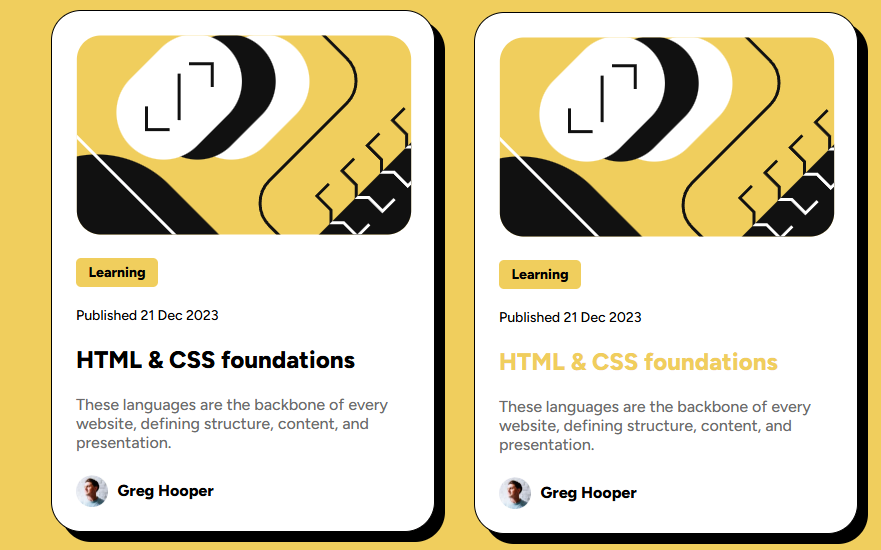

# Frontend Mentor - Blog preview card solution

This is a solution to the [Blog preview card challenge on Frontend Mentor]([https://www.frontendmentor.io/challenges/qr-code-component-iux_sIO_H](https://www.frontendmentor.io/challenges/blog-preview-card-ckPaj01IcS). Frontend Mentor challenges help you improve your coding skills by building realistic projects. 

**Note: I did this challenge before reading everything , I tried to be as close as possible visually speaking **

## Overview

### Screenshot

### Links

- Solution URL: [Solution URL](www)
- Live Site URL: [Live URL](www)

### Built with

- Semantic HTML5 markup
- CSS custom properties
- Flexbox
- CSS Grid
